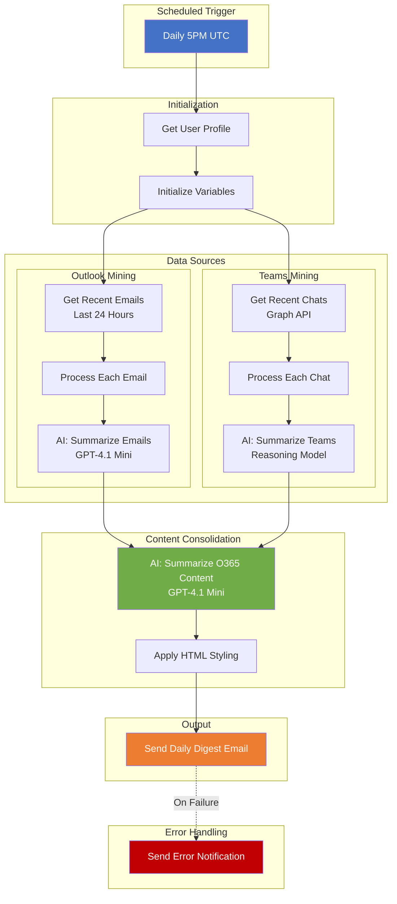

# O365 Daily Digest - Architecture Diagram

## Solution Overview

```
┌─────────────────────────────────────────────────────────────────────────────────┐
│                         O365 DAILY DIGEST ARCHITECTURE                          │
│                              Version 1.2.0.7                                    │
└─────────────────────────────────────────────────────────────────────────────────┘

                              ┌─────────────────┐
                              │   SCHEDULED     │
                              │    TRIGGER      │
                              │  (Daily 5PM)    │
                              └────────┬────────┘
                                       │
                                       ▼
┌──────────────────────────────────────────────────────────────────────────────────┐
│                          POWER AUTOMATE CLOUD FLOW                               │
│                          (GetEmailsOneNoteSched)                                 │
│  ┌─────────────────────────────────────────────────────────────────────────────┐ │
│  │                         INITIALIZATION                                      │ │
│  │  ┌──────────────┐    ┌──────────────┐    ┌──────────────┐                  │ │
│  │  │ Get User     │───▶│ Init Email   │───▶│ Init Teams   │                  │ │
│  │  │ Profile      │    │ Digest Var   │    │ Digest Var   │                  │ │
│  │  └──────────────┘    └──────────────┘    └──────────────┘                  │ │
│  └─────────────────────────────────────────────────────────────────────────────┘ │
│                                       │                                          │
│              ┌────────────────────────┼────────────────────────┐                │
│              ▼                        │                        ▼                │
│  ┌─────────────────────┐              │          ┌─────────────────────┐        │
│  │  OUTLOOK CONNECTOR  │              │          │   TEAMS CONNECTOR   │        │
│  │  (If Enabled)       │              │          │   (If Enabled)      │        │
│  └──────────┬──────────┘              │          └──────────┬──────────┘        │
│             │                         │                     │                   │
│             ▼                         │                     ▼                   │
│  ┌─────────────────────┐              │          ┌─────────────────────┐        │
│  │ Get Recent Emails   │              │          │ Get Recent Chats    │        │
│  │ (Last 24 Hours)     │              │          │ (Graph API)         │        │
│  │ Inbox - Top 1000    │              │          │ Last 24 Hours       │        │
│  └──────────┬──────────┘              │          └──────────┬──────────┘        │
│             │                         │                     │                   │
│             ▼                         │                     ▼                   │
│  ┌─────────────────────┐              │          ┌─────────────────────┐        │
│  │ For Each Email:     │              │          │ For Each Chat:      │        │
│  │ - Extract From      │              │          │ - Get Messages      │        │
│  │ - Extract Subject   │              │          │ - Parse Content     │        │
│  │ - Extract Body      │              │          │ - Filter by Date    │        │
│  │ - Append to Digest  │              │          │ - Append to Digest  │        │
│  └──────────┬──────────┘              │          └──────────┬──────────┘        │
│             │                         │                     │                   │
│             ▼                         │                     ▼                   │
│  ┌─────────────────────┐              │          ┌─────────────────────┐        │
│  │    AI BUILDER       │              │          │    AI BUILDER       │        │
│  │ ┌─────────────────┐ │              │          │ ┌─────────────────┐ │        │
│  │ │ SummarizeEmails │ │              │          │ │SummarizeTeams   │ │        │
│  │ │ (GPT-4.1 Mini)  │ │              │          │ │(Reasoning Model)│ │        │
│  │ └─────────────────┘ │              │          │ └─────────────────┘ │        │
│  └──────────┬──────────┘              │          └──────────┬──────────┘        │
│             │                         │                     │                   │
│             └─────────────────────────┼─────────────────────┘                   │
│                                       │                                          │
│                                       ▼                                          │
│                          ┌─────────────────────┐                                │
│                          │     AI BUILDER      │                                │
│                          │ ┌─────────────────┐ │                                │
│                          │ │SummarizeO365    │ │                                │
│                          │ │Content          │ │                                │
│                          │ │(GPT-4.1 Mini)   │ │                                │
│                          │ └─────────────────┘ │                                │
│                          └──────────┬──────────┘                                │
│                                     │                                            │
│                                     ▼                                            │
│                          ┌─────────────────────┐                                │
│                          │  Apply HTML Styling │                                │
│                          │  (Format for Email) │                                │
│                          └──────────┬──────────┘                                │
│                                     │                                            │
│                                     ▼                                            │
│                          ┌─────────────────────┐                                │
│                          │  Send Daily Digest  │                                │
│                          │  (Outlook Email)    │                                │
│                          └─────────────────────┘                                │
│                                                                                  │
│  ┌─────────────────────────────────────────────────────────────────────────────┐ │
│  │                         ERROR HANDLING                                      │ │
│  │  On Failure: Send error notification email with run details                 │ │
│  └─────────────────────────────────────────────────────────────────────────────┘ │
└──────────────────────────────────────────────────────────────────────────────────┘


┌──────────────────────────────────────────────────────────────────────────────────┐
│                              DATA SOURCES                                        │
├──────────────────────────────────────────────────────────────────────────────────┤
│                                                                                  │
│   ┌─────────────┐      ┌─────────────┐      ┌─────────────┐                     │
│   │  OUTLOOK    │      │   TEAMS     │      │  DATAVERSE  │                     │
│   │  MAILBOX    │      │   CHATS     │      │ (AI Models) │                     │
│   │             │      │             │      │             │                     │
│   │ User's own  │      │ User's own  │      │ Custom AI   │                     │
│   │ inbox only  │      │ chats only  │      │ Prompts     │                     │
│   └─────────────┘      └─────────────┘      └─────────────┘                     │
│                                                                                  │
└──────────────────────────────────────────────────────────────────────────────────┘


┌──────────────────────────────────────────────────────────────────────────────────┐
│                         CONNECTION REFERENCES                                    │
├──────────────────────────────────────────────────────────────────────────────────┤
│                                                                                  │
│   cr2de_O365Connector ──────────▶ Office 365 Users API                          │
│   cr2de_OutlookConnector ───────▶ Office 365 Outlook API                        │
│   cr2de_TeamsConnector ─────────▶ Microsoft Teams (Graph API)                   │
│   mccia_Office365SEDB ──────────▶ Common Data Service (AI Builder)              │
│                                                                                  │
└──────────────────────────────────────────────────────────────────────────────────┘


┌──────────────────────────────────────────────────────────────────────────────────┐
│                      ENVIRONMENT VARIABLES                                       │
├──────────────────────────────────────────────────────────────────────────────────┤
│                                                                                  │
│   cr2de_IncludeOutlook ─────────▶ Enable/Disable Outlook mining (Boolean)       │
│   cr2de_IncludeTeams ───────────▶ Enable/Disable Teams mining (Boolean)         │
│   cr2de_ScheduleTimeUTC ────────▶ Daily trigger time (Default: 21:00 UTC)       │
│                                                                                  │
└──────────────────────────────────────────────────────────────────────────────────┘


┌──────────────────────────────────────────────────────────────────────────────────┐
│                         OUTPUT: DAILY DIGEST EMAIL                               │
├──────────────────────────────────────────────────────────────────────────────────┤
│                                                                                  │
│   Subject: Daily Digest                                                          │
│   Importance: High                                                               │
│   Format: HTML                                                                   │
│                                                                                  │
│   Sections:                                                                      │
│   ├── Overview of the Day                                                        │
│   ├── Major Actions and Decisions                                                │
│   ├── System or Technical Notes                                                  │
│   ├── Collaboration and Communications                                           │
│   ├── Awareness and Announcements                                                │
│   └── Stand-Up for Tomorrow Morning                                              │
│                                                                                  │
└──────────────────────────────────────────────────────────────────────────────────┘
```

## Mermaid Diagram (for rendering in compatible tools)



## Security & Data Flow

```
┌─────────────────────────────────────────────────────────────────┐
│                     SECURITY BOUNDARY                           │
│                   (Microsoft 365 Tenant)                        │
│                                                                 │
│  ┌──────────┐    ┌──────────┐    ┌──────────┐    ┌──────────┐  │
│  │  User's  │    │  User's  │    │   AI     │    │  User's  │  │
│  │  Outlook │───▶│  Power   │───▶│ Builder  │───▶│  Outlook │  │
│  │  Inbox   │    │ Automate │    │ (Azure)  │    │  Inbox   │  │
│  └──────────┘    │          │    └──────────┘    └──────────┘  │
│                  │          │                                   │
│  ┌──────────┐    │          │                                   │
│  │  User's  │───▶│          │                                   │
│  │  Teams   │    └──────────┘                                   │
│  │  Chats   │                                                   │
│  └──────────┘                                                   │
│                                                                 │
│  Data never leaves Microsoft 365 security boundary              │
│  User only accesses their own data                              │
│  Authentication via Microsoft 365 SSO/MFA                       │
│                                                                 │
└─────────────────────────────────────────────────────────────────┘
```
